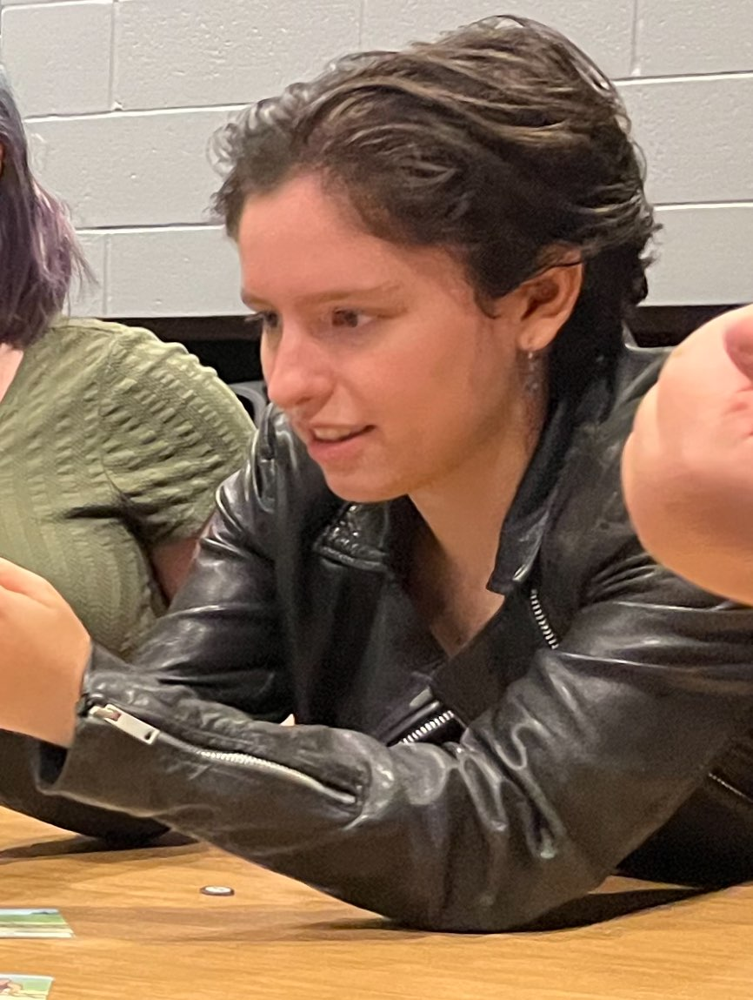
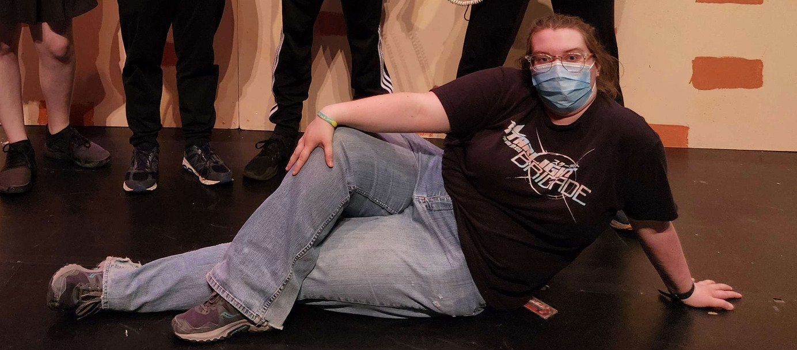
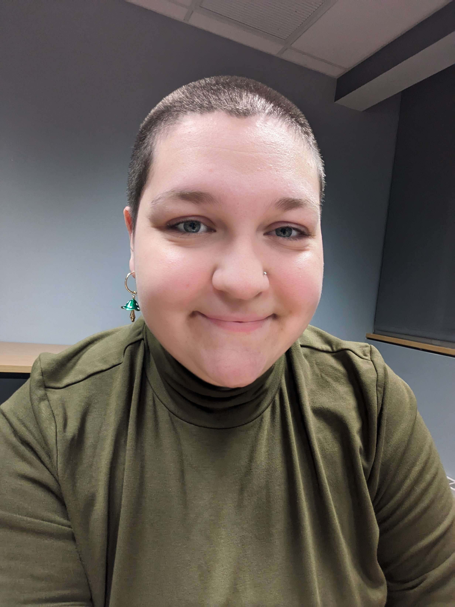
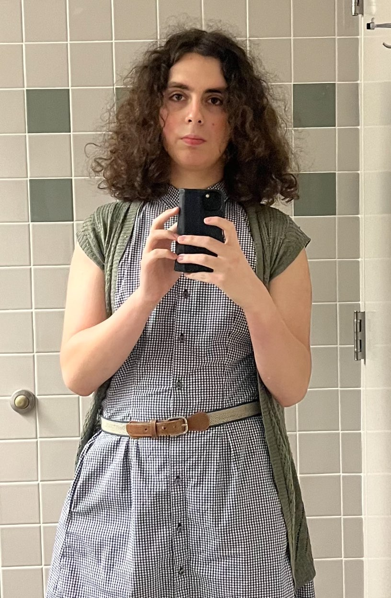
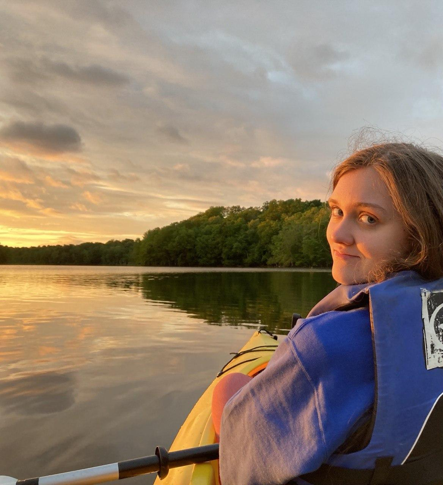
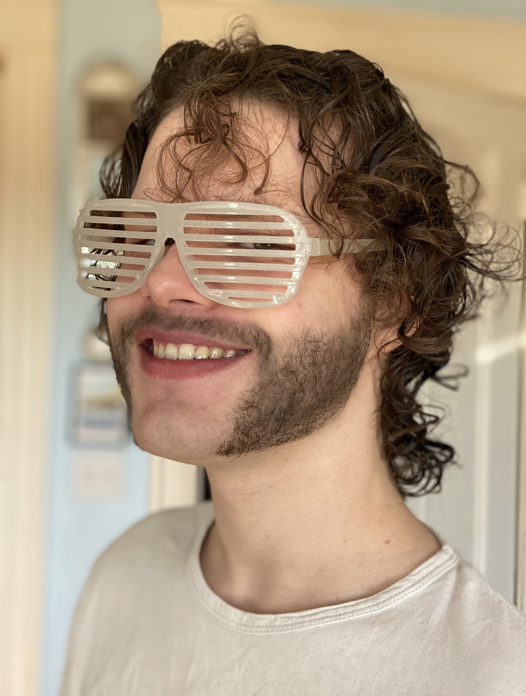
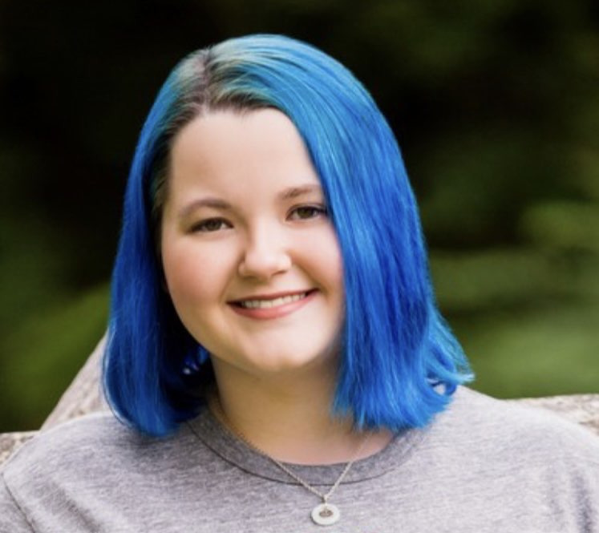
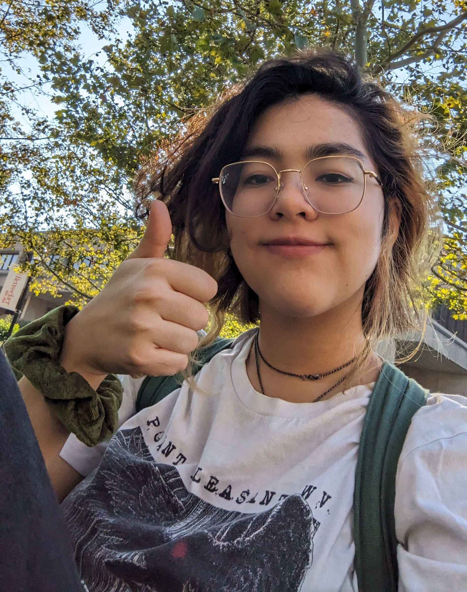
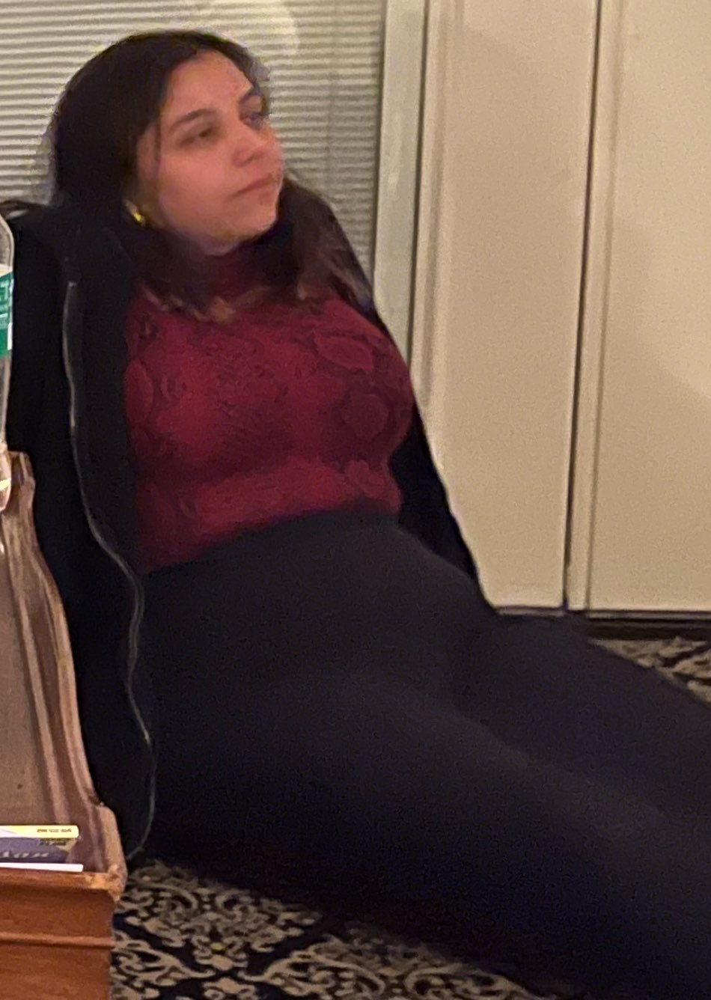

# Current Members

## Theta Class

**Sydney Stojkovic** - Electronic Arts (she/her)

## Iota Class

**Mick McCartney** - Biomedical Engineering/Music (he/they)

## Kappa Class

**Myth Cochran** - Physics (they/them)

## Lambda Class

**Julie Hakimi** - Computer Science/Computer and Systems Engineering (she/her)

**Via Peck-Kropywnyckyj** - Games & Simulation Arts & Sciences/Computer Science (they/them)

## Mu Class

**AJ Mirabella** - Biology (they/she)

**James Roy Gosnell** - Computer science (he/him)

**Keira Trout** - Aerospace Engeneering (she/her)

**Trinity S Gagnon** - Design, Innovation, & Society (she/her)

## Nu Class

**Isabella Alicia Remedios** - Games and Simulation Arts & Sciences / Electronic Arts (she/her)

**Siggy Nazimowitz** - Computer Science (he/him)

# Alumni

## Founding Class

**Alex MacNair** - EMAC/CompSci 

**Alexander Gordon Schneiderman** - Architecture 

**Amanda Howanice** - Games Simulations and Arts and Sciences 

**Carly Blaugher** - Nuclear Engineering 

**Charity Kaye Guiquin** - Environmental Engineering 

**Daniel Ruan** - Architecture 

**Erin Arthur** - Chemical Engineering 

**Ezra Shamira Borman** - Game Simulations and Arts and Sciences 

**Milo Zappa Trujillo** - Computer Science / Science, Technology, and Society 

**Perrin Mercer** - Games Simulations and Arts and Sciences 

**Taylor Foxe Dahlin** - Computer Science 

## Alpha Class

**Rebecca Marie Halzack** - Civil Engineering 

**Tyler Kenneth Johnston** - Computer Science 

## Beta Class

**Andie Dolan** - Civil Engineering 

**Claire Thomas** - Games & Simulation Arts & Sciences 

**Kibo Schaffer** - Computer Science 

**Kristine Stewart** - Product Design & Innovation 

**Rose Clare Pisacano** - Environmental Engineering 

## Gamma Class

**Eric H Gayle** - Mechanical/Aeronautical 

**Isabella Akemi Soares** - Architecture 

**Neil M Sullivan** - Mechanical  

**Odin C Goldman** - Cognitive Science 

**Shea Kathleen Roe** - Bionformatics + Molecular Biology 

## Delta Class

**Adam James Bogdanowicz** - Math 

**Erin Solomon** - MechE/PDI 

**Pam Sweig** - DIS/ MGMT 

## Epsilon Class

**Jordan Fay Plummer** - Business Management/Pre-Law 

**Kristina Marie Ferrara** - Biochemistry and Biophysics 

**Sarah L Levinson** - Chemical Engineering 

## Zeta Class

**Alex Elbendary** - Civil Engineering

**Alvah Higginson** - Applied Physics 

**Oliver Shuey** - Mechanical Engineering 

**Rachel Emily Friedman** - Aeronautics Engineering 

## Eta Class

**Ben Sherman** - Computer Science/Math 

**Chaz D Bernstein** - Materials Science 

**Pomai Pōmaikaʻi Ahlo** - Computer Science 

## Theta Class

**Faizah Rabbye** - Computer and Systems Engineering 

**James Benjamin Lewin** - Electrical engineering and applied physics 

## Iota Class

**Craig Burnett** - Architecture

**Hui Min Guo** - Chemistry  

## Lambda Class

**Mauricio Ibarra-Towle** - Aeronautical Engineering + MBA 

## Mu Class

**Betsy He** - Electronic Art dual Business Management 
